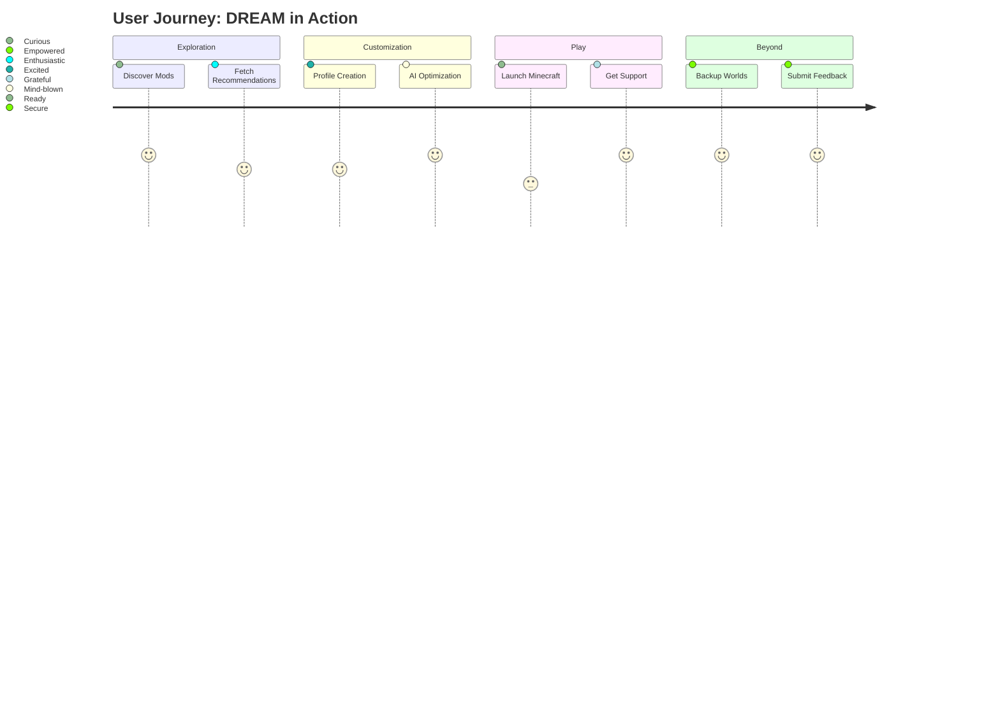

# DREAM: The Ultimate AI-Powered Minecraft Modpack Manager

A celestial orchestrator for mod enthusiasts—automated, supercharged, and dazzling.  
**Curate, optimize, and launch next-generation Minecraft gameplay with the power of AI, exclusive shaders, and seamless profile management.**  
**Welcome to the future of Minecraft modding.**

---
## 🚀 Download & Embark Instantly

Start your journey to seamless mod management:

---

## 🌠 Overview

Welcome to **DREAM**, the cosmic suite designed for the modern Minecraft explorer. Whether you’re questing across dimensions, chasing performance, or forging spectral servers, DREAM delivers an all-in-one experience for all mod collectors. This is not merely a modpack; DREAM is your AI-powered mission control blending exclusive shaders, technical tweaks, and idiomatic configurations into a sinuous dance. Each mod and setting is hand-selected for stability, innovation, and awe.

Harness AI through **OpenAI** and **Claude**, automatically optimize your gameplay with intelligent presets, and enjoy 24/7 support for hassle-less adventures. Welcome to the constellation of the future.

---

## ✨ Features List

- **AI-Powered Mod Recommendations:**  
  Curated lists and personal optimization suggestions powered by OpenAI and Claude.

- **Superlative Shaders & Dimensions:**  
  Push graphics beyond the horizon and venture into never-seen worlds.

- **Responsive & Adaptive UI:**  
  Designed for every device—desktop, tablet, and mobile.

- **Profile-Based Configuration:**  
  Switch between custom setups for servers, single player, or creative worlds in a flash.

- **One-Click Modpack Downloads:**  
  Automated dependency resolution for a smooth installation.

- **Multilingual Experience:**  
  Fluent support for English, Spanish, German, French, and Mandarin. Localize your adventure.

- **Automated Conflict Resolver:**  
  No more headaches—AI scans and resolves mod conflicts for ultimate harmony.

- **Cloud Sync & Backups:**  
  Safeguard your settings and worlds with secure, on-demand cloud storage.

- **Live 24/7 Stellar Support:**  
  Never lost in the cosmic void—expert help around the clock.

- **SEO-Optimized for Minecraft Mods & Modpacks:**  
  Discover and be discovered—rocketing up search results.

---

## 🌍 OS Compatibility Table

| Operating System       | Supported       | Special Note               |
|-----------------------|:---------------:|---------------------------|
|  | ✅ | Full feature set |
|  | ✅ | M1/M2 supported |
|  | ✅ | Snap, AppImage    |
|  | 🟠 | Limited features  |
|  | ⏳ | Planned Q2 2026   |

---

## 🗺️ Feature Roadmap

Stay a step ahead with transparency into future enhancements:

---

## 🧬 Example Profile Configuration

DREAM lets you craft unique environment profiles for every scenario. Here’s an example shorthand YAML configuration:

    profile_name: "TechDREAM-Server"
    minecraft_version: "1.20.2"
    mods:
      - "QuantumShades[2.5.1]"
      - "EndlessDimensions[1.3.2]"
      - "RocketTweaks[4.4.4]"
    ai_presets:
      visual_enhancements: true
      performance_mode: "ultra"
      ai_resolution: true
    language: "en"
    cloud_backup: enabled

---

## 💻 Example Console Invocation

Command-line acolytes, take note! Instantly switch or create new mod profiles:

    dreamctl profile apply TechDREAM-Server
    dreamctl ai optimize --visual ultra
    dreamctl mod install QuantumShades
    dreamctl backup sync --all

---

## 🔑 Key Features

- **OpenAI API Integration:**  
  DREAM consults GPT-4 through secure endpoints to recommend, explain, and even optimize mods based on your profile, hardware, and ambitions.

- **Claude AI Enhancement:**  
  Leverage Anthropic Claude for ethical suggestions, deep-dive explanations, and natural language configuration.

- **Responsive UI:**  
  Every pixel glistens on any form factor—desktop, ultrawide, tablet, or phone.

- **Multilingual Support:**  
  For a truly global minecart. Expand with confidence.

- **Stellar 24/7 Support:**  
  Our team—both human and AI—are here all day, every day.

- **Cloud Sync:**  
  Keep worlds, mods, and settings safe among the stars.

---

## 👉 SEO-Focused Phrasing (for Discoverability)

DREAM launches Minecraft modding into a new era with AI insights, technical curation, and next-gen graphics support. Whether you’re searching for "best Minecraft mod manager," "AI-generated mod profiles," "premium shaders," or "one-click Minecraft modpack install," DREAM is poised to be your top result.

---

## ⚠️ Disclaimer

DREAM is an independently curated project designed to simplify and enhance your Minecraft mod experience.  
We are not affiliated with Mojang, Microsoft, OpenAI, or Anthropic.  
All linked mods are subject to their respective licenses, and all AI interactions comply with their providers' terms of service.  
Use at your own discretion. We strive for compatibility, but modding always carries a hint of the unknown.

---

## 📜 LICENSE

DREAM is released under the MIT License. See [MIT License](https://opensource.org/licenses/MIT) for details.

---

## ⬇️ Download & Begin Your Celestial Adventure

---

**© DREAM Team 2026 – Your next Minecraft journey is just beginning.**